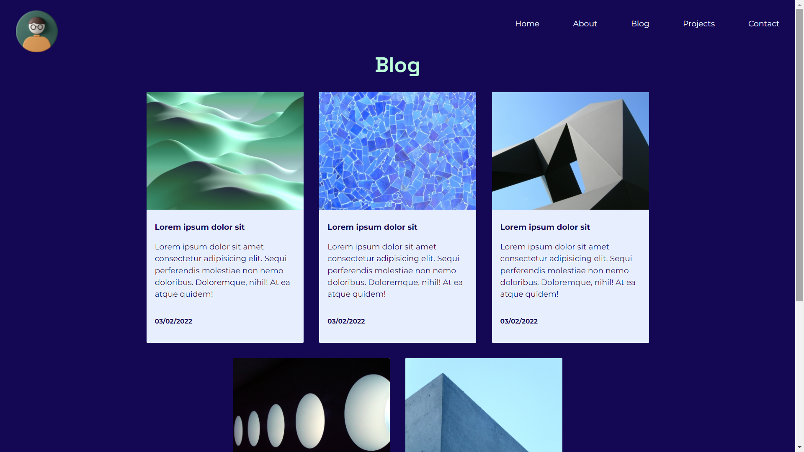

# 1. Portfolio website: 
  https://tracey-ngo.netlify.app/project.html
# 2. Github repo: 
https://github.com/NTracey/CA

# 3. Description of portfolio website
## Purpose
  The purpose of the portfolio is to showcase my abilities, information about myself and work as a web developer to advertise myself. 
## Functionality/Features.
All pages share a common which includes the font, background, navbar and footer.
- ### Home page
  - Small introduction of myself
  - Navigation bar on top that turns into a hamburger menu on mobile size.
  - Footer with links to github, linkedin and contact page.
  - Two buttons that links to about me and contact page.
- ### About page
  - Summary about me, including my interest.
  - Skill uses flex-wraps as it the screen size compresses.
  - Resume with a download link to the pdf.
  - My study History uses flex-wrap to separate side by side divs in desktop view.
- ### Blog
  - The cards uses flex-wrap and each are linked to a blog post .
- ### Blog Post
  - Image floats to the right in desktop view.
  - Text wraps the image in desktop view.
  - Quotation marks expands in desktop view.
- ### Project
  - Cards flex-wraps
- ### Contact
  - Users can input into the form and submit to my email.
## Sitemap

## Portfolio website screenshots
### Home page

### About page

### Blog page

### Blog post page

### Project page

### Contact page

## Target Audience
HR managers, software developers, employers, and recruiters who wants to contact a developer and is in the IT industry
## Tech Stack
  I used HTML and CSS and deployed my website through Netlify.

# Reference
- Free Frontend. 2022. 21 CSS Blog Cards. [online] Available at: <https://freefrontend.com/css-blog-cards/> [Accessed 2 March 2022].
- Icons8. 2022. [online] Available at: <https://icons8.com/> [Accessed 28 February 2022].
- Colorhunt.co. 2022. Color Palette: #170055 #3E00FF #AE00FB #B5FFD9 - Color Hunt. [online] Available at: <https://colorhunt.co/palette/1700553e00ffae00fbb5ffd9> [Accessed 2 March 2022].
- Andraware. 2022. Create Responsive Navbar Using HTML and CSS. [online] Available at: <https://www.andraware.com/create-responsive-navbar-using-html-and-css/> [Accessed 1 March 2022].
- Dossena, F., 2022. Cool and responsive buttons with a few lines of CSS. [online] Federico Dossena. Available at: <https://fdossena.com/?p=html5cool/buttons/i.frag> [Accessed 2 March 2022].
- Iconscout. 2022. Download 4.1 M+ Icons, 3D Illustrations & Lottie Animations | Iconscout. [online] Available at: <https://iconscout.com/> [Accessed 2 March 2022].
- Fontawesome.com. 2022. Font Awesome. [online] Available at: <https://fontawesome.com/> [Accessed 1 March 2022].
- Flaticon. 2022. Free Icons and Stickers - Millions of resources to download. [online] Available at: <https://www.flaticon.com/> [Accessed 1 March 2022].
- W3schools.com. 2022. How To Create a Contact Form with CSS. [online] Available at: <https://www.w3schools.com/howto/howto_css_contact_form.asp> [Accessed 2 March 2022].
- Nichols, D., 2022. Coloring for Colorblindness. [online] Davidmathlogic.com. Available at: <https://davidmathlogic.com/colorblind/#%23D81B60-%231E88E5-%23FFC107-%23004D40> [Accessed 3 March 2022].